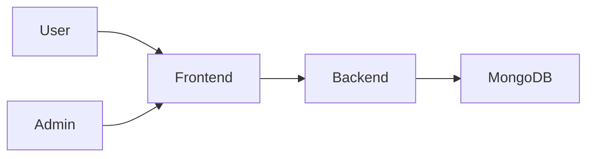

# FixIt — Complaint & Service Management Platform

FixIt is a small full-stack application designed for learning CI/CD in a realistic but beginner-friendly way. It includes a React frontend, an Express + MongoDB backend, JWT-based authentication, complaint management, admin workflows, and a GitHub Actions pipeline.

## Problem statement

Organizations often need one place to collect service requests, track their status, and coordinate actions across departments. Many teams still rely on scattered emails, messages, or paper logs. FixIt brings this into a simple digital workflow.

## Features

- User registration and login
- Complaint creation with validation
- Complaint tracking by status and priority
- Admin dashboard for review and status updates
- Role-based access control
- MongoDB persistence with Mongoose
- Automated tests for frontend and backend
- GitHub Actions CI workflow

## Tech stack

- Frontend: React, Vite, JavaScript, CSS
- Backend: Node.js, Express.js, JavaScript
- Database: MongoDB, Mongoose
- Auth: JWT and bcrypt
- Testing: Vitest, Supertest
- CI/CD: GitHub Actions

## Architecture



## Folder structure

```text
fixit/
├── client/
│   ├── src/
│   ├── public/
│   ├── package.json
│   ├── vite.config.js
│   └── index.html
├── server/
│   ├── src/
│   ├── tests/
│   └── package.json
├── .github/
│   └── workflows/
│       └── ci.yml
├── .env.example
├── .gitignore
├── README.md
├── package.json
└──
```

## Local setup

1. Clone the repository.
2. Install root dependencies if needed.
3. Install frontend dependencies:
   npm --prefix client install
4. Install backend dependencies:
   npm --prefix server install
5. Create a local .env file using .env.example.
6. Start MongoDB locally or use a local MongoDB instance.

## Environment variables

Create a .env file in the project root. The file must not be committed to Git.

```env
MONGODB_URI=mongodb://127.0.0.1:27017/fixit
JWT_SECRET=replace_with_a_secure_secret
PORT=5000
ADMIN_EMAIL=admin@fixit.local
ADMIN_PASSWORD=change-this-development-password
```

## Running the frontend

```bash
npm --prefix client run dev
```

The frontend runs on http://localhost:5173.

## Running the backend

```bash
npm --prefix server run dev
```

The backend runs on http://localhost:5000.

## Seed a development admin

Set `ADMIN_EMAIL` and `ADMIN_PASSWORD` in the local environment, then run:

```bash
npm --prefix server run seed:admin
```

The seeded account uses the same login page as regular users and is assigned the `ADMIN` role. Never use development credentials in production.

## Running tests

Frontend tests:

```bash
npm --prefix client test -- --run
```

Backend tests:

```bash
npm --prefix server test -- --run
```

## Git workflow

```bash
git checkout -b feature/my-change
git add .
git commit -m "Add feature"
git push origin feature/my-change
```

Then open a pull request to the main branch.

## CI/CD explanation

A CI pipeline is the automated process that checks whether code is safe to merge. In this project, GitHub Actions runs on a temporary Ubuntu machine whenever code is pushed to main or a pull request is opened.

### What is a runner?

A runner is a temporary virtual machine or environment that GitHub creates to execute workflow steps. In this project, it runs on Ubuntu.

### Where does npm ci run?

It runs inside the GitHub runner environment after the repository is checked out. The runner downloads dependencies and executes the commands defined in the workflow.

### Where are dependencies installed?

Dependencies are installed in the runner environment, not in your local machine. This makes the build reproducible and consistent across developers.

### What happens when the runner starts?

1. GitHub checks out the repository.
2. Node.js is installed.
3. Dependencies are installed.
4. Tests run.
5. Build steps run.
6. The workflow exits with success or failure.

### Why is the runner temporary?

Each workflow run gets a fresh environment so tests and builds are isolated and repeatable. This reduces contamination and helps catch issues early.

### What causes the pipeline to fail?

- failing tests
- missing dependencies
- code that does not build
- invalid workflow syntax
- backend or frontend runtime issues in the CI environment

### How to view workflow logs in GitHub Actions

1. Go to the GitHub repository.
2. Click the Actions tab.
3. Select the workflow run.
4. Review the jobs and logs for each step.

## GitHub Actions

The workflow is stored in .github/workflows/ci.yml. It performs the following steps:

- checkout repository
- setup Node.js
- install client dependencies
- install server dependencies
- run frontend tests
- run backend tests
- build frontend
- verify backend startup path

## Future roadmap

- Docker support
- Deployment to cloud hosting
- Environment-specific configurations
- CD pipeline automation
- Monitoring and health checks

## Notes

This project is intentionally small and focused on learning CI/CD concepts. It is not a large enterprise system, but it demonstrates a realistic software delivery pipeline.
